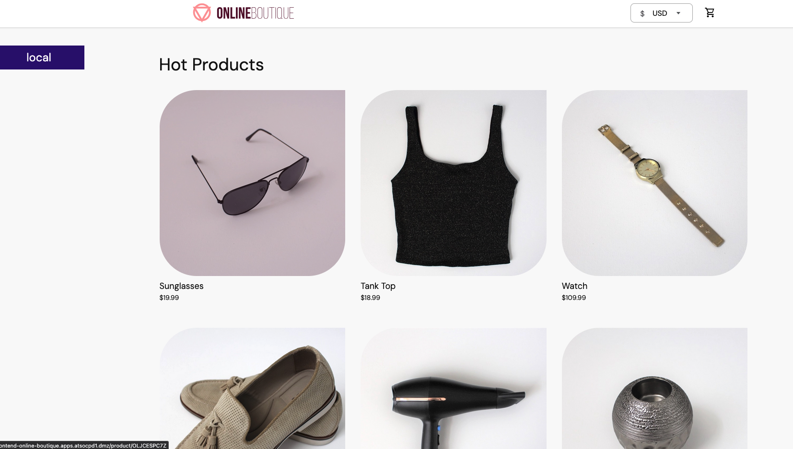

**Online Boutique** is a cloud-first microservices demo application.  The application is a
web-based e-commerce app where users can browse items, add them to the cart, and purchase them.

This version of Online Boutique has been modified to run on both Intel/x86 (amd64) architecture as well as IBM LinuxONE (s390x). Simply follow the installation instructions below to deploy on OpenShift.

## Deploying to OpenShift

1. Create a new project 

   ```
   oc new-project online-boutique
   ```

2. Deploy the application

   ```
   oc apply -f kubernetes-manifests/

3. Expose the frontend service as a route

   ```
   oc expose svc frontend
   ```

4. Navigate to your frontend route in a web browser

   You can print the URL with the command: 

   ```
   echo "http://$(oc -n online-boutique get route frontend -o=jsonpath='{.spec.host}')"
   ```

   You will see something like the following:

   ```
   http://frontend-online-boutique.apps.local
   ```

   Navigate to the URL to see your Online Boutique homepage

   

## Architecture

**Online Boutique** is composed of 11 microservices written in different
languages that talk to each other over gRPC.

[](/docs/img/architecture-diagram.png)

| Service                                              | Language      | Description                                                                                                                       |
| ---------------------------------------------------- | ------------- | --------------------------------------------------------------------------------------------------------------------------------- |
| [frontend](/src/frontend)                           | Go            | Exposes an HTTP server to serve the website. Does not require signup/login and generates session IDs for all users automatically. |
| [cartservice](/src/cartservice)                     | C#            | Stores the items in the user's shopping cart in Redis and retrieves it.                                                           |
| [productcatalogservice](/src/productcatalogservice) | Go            | Provides the list of products from a JSON file and ability to search products and get individual products.                        |
| [currencyservice](/src/currencyservice)             | Node.js       | Converts one money amount to another currency. Uses real values fetched from European Central Bank. It's the highest QPS service. |
| [paymentservice](/src/paymentservice)               | Node.js       | Charges the given credit card info (mock) with the given amount and returns a transaction ID.                                     |
| [shippingservice](/src/shippingservice)             | Go            | Gives shipping cost estimates based on the shopping cart. Ships items to the given address (mock)                                 |
| [emailservice](/src/emailservice)                   | Python        | Sends users an order confirmation email (mock).                                                                                   |
| [checkoutservice](/src/checkoutservice)             | Go            | Retrieves user cart, prepares order and orchestrates the payment, shipping and the email notification.                            |
| [recommendationservice](/src/recommendationservice) | Python        | Recommends other products based on what's given in the cart.                                                                      |
| [adservice](/src/adservice)                         | Java          | Provides text ads based on given context words.                                                                                   |
| [loadgenerator](/src/loadgenerator)                 | Python/Locust | Continuously sends requests imitating realistic user shopping flows to the frontend.                                              |

